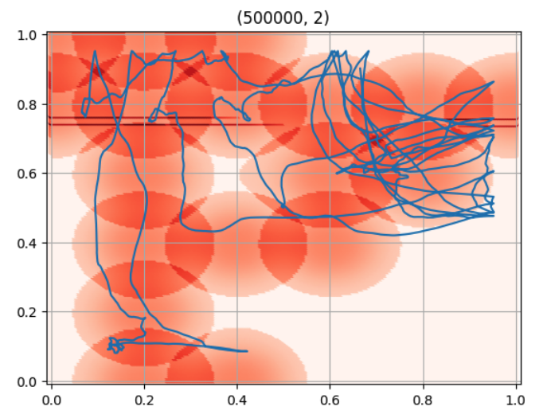
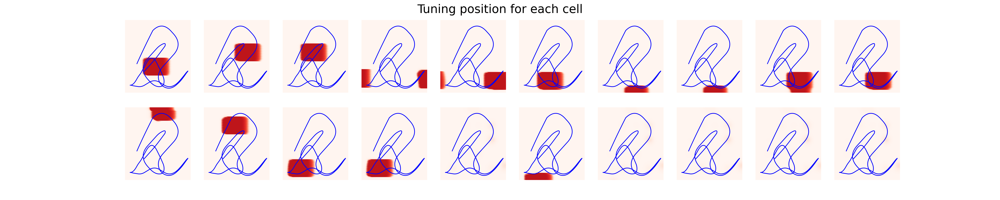
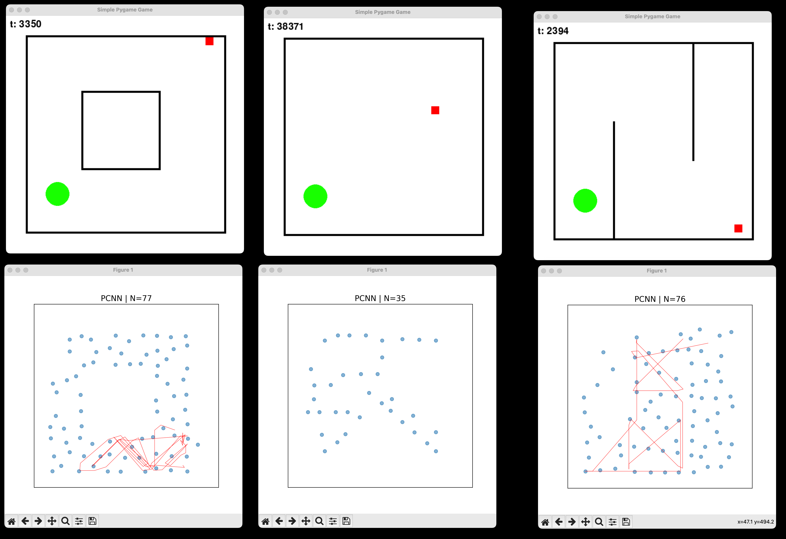

# PCNN
Acronym for Place Cells Neural Network.

### Gist
*an agent should have a machinery able to form a spatial representation of the input with the following features:*
- place cells encoding for (unique) *positions* in the input space 
- place cells should form quickly and *online*
*How?*
- rate neurons
- hebbian plasticity 
- background stimulation from internal theta oscillations 
- neuromodulation-dependant learning (dopamine)

The results below are obtained from a simulation where the agent walked a trajectory spanning most of the environment.

